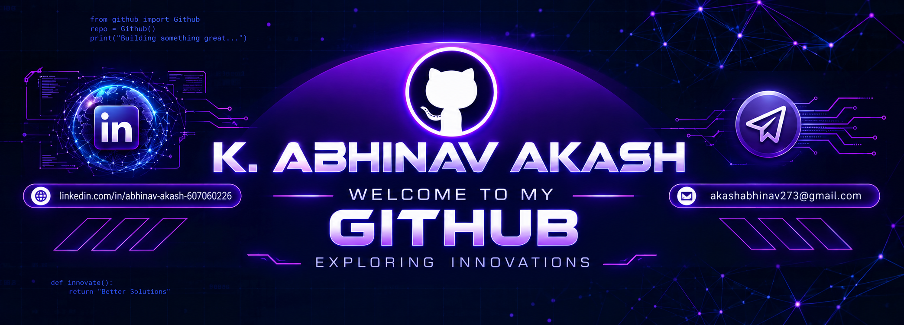

<div align="center">



### 🤖 Machine Learning Engineer | Data Engineer | AI Enthusiast

<p align="center">
  <a href="https://www.linkedin.com/in/abhinav-akash-607060226/">
    
  </a>
  <a href="mailto:akashabhinav273@gmail.com">
    
  </a>
</p>

</div>
---

## 👨‍💻 About Me

🎓 **B.Tech in Electronics & Communication Engineering**  
🎯 Specialized in **Machine Learning & Digital Media Processing**  
📊 Aspiring **Machine Learning / Data Engineer**  
🤖 Interested in **Artificial Intelligence & Generative AI**  
☁️ Experienced with **Oracle Cloud Infrastructure & Data Integration**  
🐍 Strong foundation in **Python, SQL, Data Analysis & Machine Learning**

I enjoy building practical AI and data-driven solutions involving **machine learning, predictive analytics, time-series forecasting, data pipelines, NLP, and Generative AI.**

---

## 💼 Professional Experience

### 🏢 Cognizant
**Data / Cloud Integration | July 2025 – November 2025**

- Developed enterprise integration solutions using **Oracle Integration Cloud (OIC), SOA Suite, Oracle Visual Builder, and OCI**
- Designed secure **SFTP-based integration workflows**
- Worked on data extraction, transformation, and validation workflows
- Assisted in troubleshooting integration issues and application performance optimization

### 🛰️ Defence Research and Development Laboratories
**Technical Intern | May 2023 – July 2023**

- Studied communication network design and signal transmission
- Worked with communication architectures and network configuration
- Analyzed technical documentation related to aerospace systems

---

## 🧠 Technical Skills

### 💻 Programming & Tools

<p align="left">
  
</p>

**Python • SQL • OOPs • Data Structures**

---

### 📊 Data Science & Data Engineering

**Data Cleaning • Data Preprocessing • ETL • Data Pipelines  
Data Models • Data Solutions • Data Analysis • Feature Engineering**

---

### 🤖 Machine Learning & AI

**Statistics • Regression • Classification • Clustering  
Random Forest • XGBoost • LSTM • Deep Learning  
Feature Engineering • Model Evaluation • Time-Series Forecasting**

---

### 🐍 Python Libraries

<p align="left">
  
  
  
  
  
</p>

**Pandas • NumPy • Matplotlib • Seaborn • Scikit-learn**

---

### ☁️ Oracle & Cloud Technologies

**Oracle Cloud Infrastructure (OCI)  
Oracle Integration Cloud (OIC)  
Oracle APEX  
Oracle Visual Builder Cloud Service (VBCS)**

---

### 🔧 System Design

**Load Balancing • RESTful APIs**

---

## 🚀 Featured Projects

### 📈 Retail Demand Forecasting Using XGBoost
**Machine Learning • Time Series • XGBoost • Python**

- Built a demand forecasting model using **1M+ retail records**
- Performed time-series feature engineering and developed an **XGBoost forecasting model**
- Achieved **R² = 0.9601**, **MAE = 2.60**, and **RMSE = 3.26**
- Created an inventory recommendation module for data-driven stock planning

---

### ✈️ Flight Fare Prediction Using Random Forest
**Machine Learning • Random Forest • Regression**

- Built a flight fare prediction model using **Random Forest Regressor**
- Applied feature engineering, categorical encoding, and hyperparameter tuning

---

### 🌦️ Multivariate Time Series Prediction
**LSTM • Attention • Deep Learning • Time Series**

- Developed a **Hybrid LSTM-Attention model** for multivariate climate datasets
- Performed normalization, feature engineering, and performance evaluation

---

### 🤖 AI Job Application Analyzer
**Streamlit • NLP • TF-IDF • Gemini AI • Scikit-learn**

- Built an AI-powered application for comparing resumes with job descriptions
- Implemented **NLP-based text similarity** and integrated **Gemini AI** for resume-fit analysis and skill gap identification

---

## 🏆 Certifications

### 🤖 Artificial Intelligence
- **Oracle Cloud Infrastructure 2025 AI Foundations Associate**
- **Oracle Cloud Infrastructure 2025 GEN AI Professional**
- **Tessolve – AI & ML Using Python**
- **Cisco Networking Academy – Data Science Essentials with Python**

---

## 📊 GitHub Overview

<div align="center">

<a href="https://github.com/Abhinav-273">
  
</a>
<a href="https://github.com/Abhinav-273?tab=repositories">
  
</a>

</div>

---

## 🧩 Areas of Interest

```text
🤖 Artificial Intelligence
🧠 Generative AI
📊 Data Analytics & Predictive Analytics
🐍 Machine Learning & Deep Learning
📅 Time-Series Forecasting
🗄️ Data Engineering & Data Pipelines
☁️ Cloud Integration
💬 Natural Language Processing
